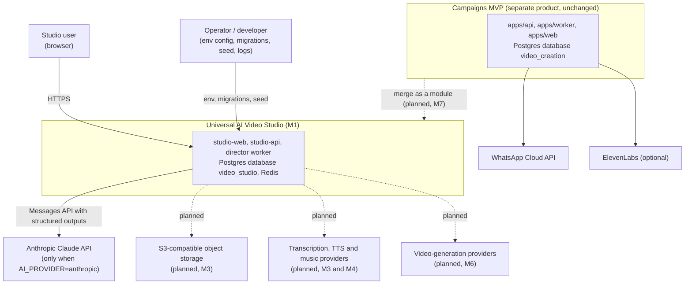
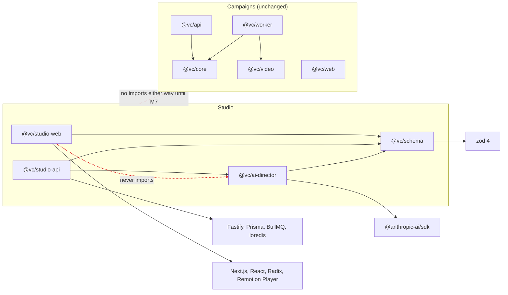
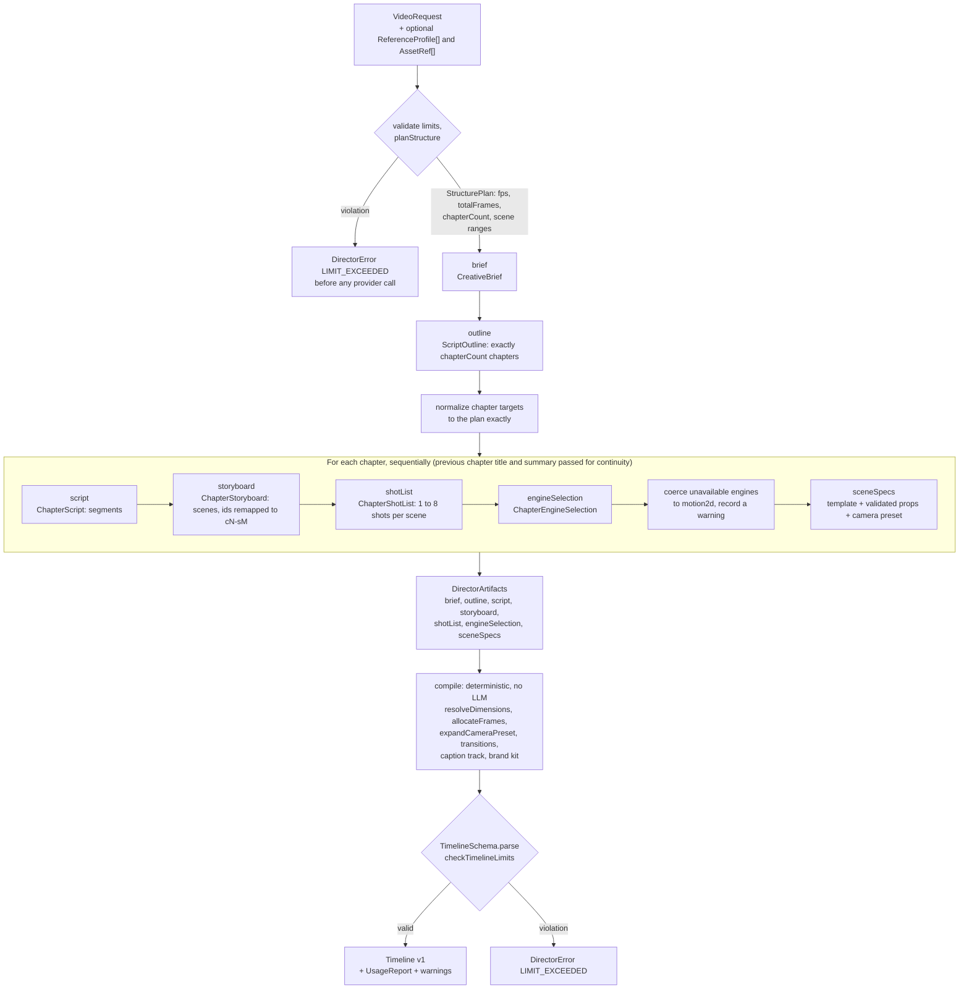
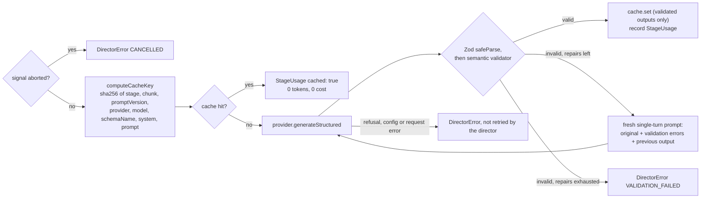
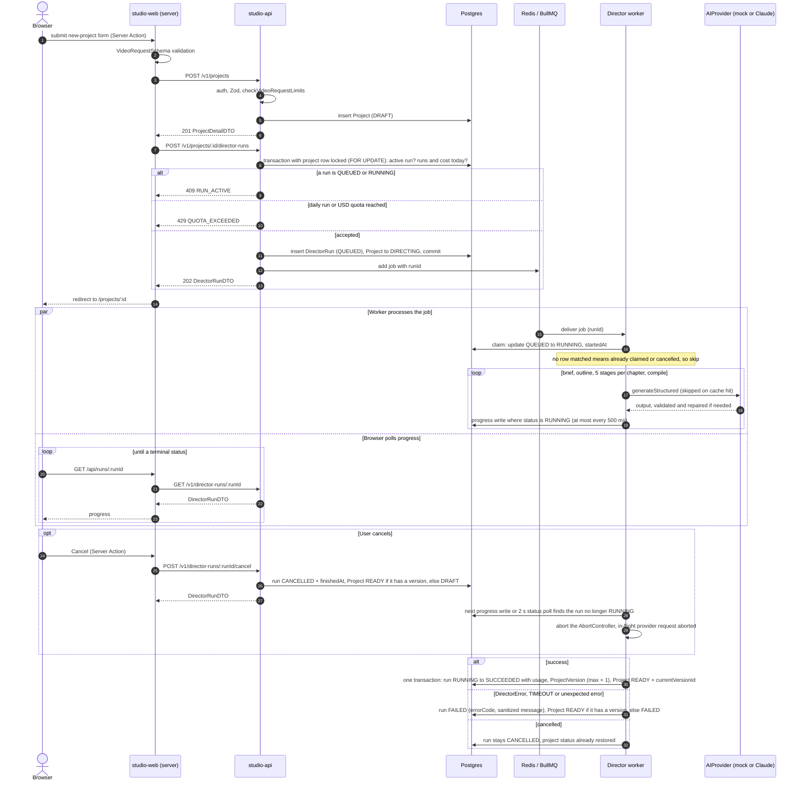
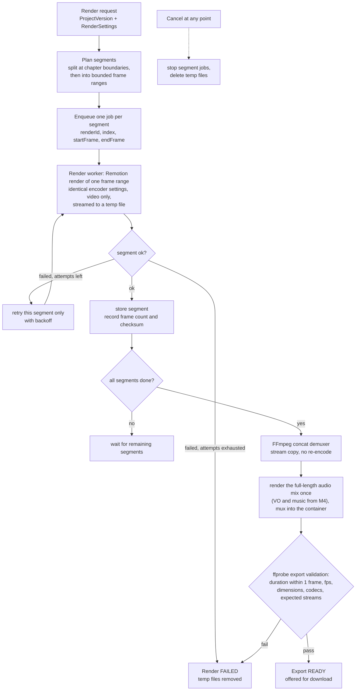

# Architecture

| | |
|---|---|
| Document status | Living document. Revised at each milestone close. |
| Last updated | 2026-10-09 |
| Current milestone | **M1 Foundation (in progress)**. See [ROADMAP.md](ROADMAP.md). |
| Contract | [milestones/M1_IMPLEMENTATION_SPEC.md](milestones/M1_IMPLEMENTATION_SPEC.md) |
| Related | [PRD.md](PRD.md) · [AI_DIRECTOR.md](AI_DIRECTOR.md) · [TIMELINE_SCHEMA.md](TIMELINE_SCHEMA.md) · [DATABASE.md](DATABASE.md) · [DECISIONS.md](DECISIONS.md) · [DEVELOPMENT.md](DEVELOPMENT.md) · [CAMPAIGNS.md](CAMPAIGNS.md) |

**Status labels used here.** **M1** means it is part of the milestone being built now. **Planned (Mx)** means it does not
exist in the code yet and is scheduled for milestone Mx. Diagrams draw planned parts with dashed lines or inside a box labelled
"Planned".

This document follows the M1 implementation spec. If the shipped code and this document disagree, the code is right and this
document has a bug to fix.

---

## 1. Overview

The Universal AI Video Studio turns a written request into a structured, editable video project. M1 builds the planning half:
a request goes in, and validated director artifacts plus a versioned, integer-frame **timeline** come out. The web app shows
them, including an animatic preview. Rendering to a video file is **planned (M2)**.

Design principles:

1. **Plan, validate, compile.** An LLM (Anthropic Claude, or a deterministic mock) produces JSON one stage at a time. Every
   stage output passes Zod and a semantic validator before anything uses it. A deterministic compiler, with no LLM involved,
   turns the validated plan into a `Timeline`.
2. **The timeline is the contract.** Preview, editor (planned, M2) and renderers (planned, M2+) consume only the timeline
   ([ADR-011](DECISIONS.md#adr-011-integer-frames-and-a-versioned-timeline-with-migrations)).
3. **Data, not code.** The model fills props of a fixed, reviewed template catalog. Nothing the model writes is ever executed
   ([ADR-009](DECISIONS.md#adr-009-fixed-template-catalog-with-per-template-zod-props-never-llm-generated-code)).
4. **Honest capabilities.** An engine or provider is reported as available only when it actually works in the deployment.
   Everything else is reported with a reason.
5. **Mock by default.** `AI_PROVIDER=mock` is the default, so development, tests and CI need no API key and spend no credits.
6. **Postgres is the source of truth.** Queue jobs carry only an id. Workers re-read state from the database.
7. **Secrets stay on the server.** The web app calls the API from its server side only
   ([ADR-017](DECISIONS.md#adr-017-nextjs-accesses-the-api-server-side-only)).

The repository also contains a separate, working product, the **WhatsApp personalized-video campaigns MVP**. M1 does not change
it. It is planned to merge into the studio as a module in M7
([ADR-002](DECISIONS.md#adr-002-build-the-studio-beside-the-campaigns-mvp-merge-in-m7)).

## 2. Repository layout

pnpm 10 workspace (`packages/*`, `apps/*`), Node 22, ESM everywhere, strict TypeScript from `tsconfig.base.json`. Workspace
packages are consumed as TypeScript source (`"exports": {".": "./src/index.ts"}`), with no build step.

| Path | Package | Product | Stack | Role | Status |
|---|---|---|---|---|---|
| `packages/schema` | `@vc/schema` | Studio | TypeScript, Zod 4 | Isomorphic schemas and types: Timeline v1 and its invariants, render settings, frame math, assets, camera, transitions, layers, scene content for 6 engines, tracks, brand kit, resource limits, timeline migrations, `ReferenceProfile` v1, director artifacts, template catalog (14 templates), API DTOs | M1 |
| `packages/ai-director` | `@vc/ai-director` | Studio | TypeScript, Zod 4, `@anthropic-ai/sdk` | Server-only AI Director: structure planning, staged pipeline, repair loop, semantic validators, provider adapters (heuristic mock, scripted mock, Anthropic), content-hash cache interface, usage and cost, deterministic timeline compiler, versioned prompts | M1 |
| `apps/studio-api` | `@vc/studio-api` | Studio | Fastify 5, Prisma 7.10 + `@prisma/adapter-pg`, BullMQ 5 + ioredis, Zod 4 | HTTP API on port 4100, Prisma schema and migrations, director worker entrypoint (`src/worker.ts`), Prisma-backed director cache, seed script | M1 |
| `apps/studio-web` | `@vc/studio-web` | Studio | Next.js 16 App Router, React 19, Tailwind CSS v4, Radix, Remotion Player 4.0.534 | Web UI on port 3000: dashboard, new-project form, project page with animatic preview, settings | M1 |
| `apps/api` | `@vc/api` | Campaigns | Express 5, Zod 3, multer | REST API on port 4000: templates, campaigns, CSV import, render and send triggers, WhatsApp webhook | Existing, unchanged |
| `apps/worker` | `@vc/worker` | Campaigns | BullMQ, Remotion renderer, FFmpeg | Render workers (Remotion + FFmpeg) and rate-limited WhatsApp send workers | Existing, unchanged |
| `apps/web` | `@vc/web` | Campaigns | React, Vite | Operator panel on port 5173 | Existing, unchanged |
| `packages/core` | `@vc/core` | Campaigns | pg, BullMQ, S3 client, Zod 3 | Shared config, DB, queues, storage, WhatsApp client, CSV and phone helpers | Existing, unchanged |
| `packages/video` | `@vc/video` | Campaigns | Remotion | Campaign video compositions (`PersonalizedIntro`, `TravelOffer`) | Existing, unchanged |
| `db/migrations` | — | Campaigns | SQL | Raw SQL migrations for the `video_creation` database | Existing, unchanged |
| `docker-compose.yml`, `docker/postgres/init-databases.sql` | — | Shared | Postgres 16, Redis 7 | Local infrastructure. Creates `video_creation` (campaigns) and, on a fresh volume, `video_studio` and `video_studio_test` (studio) | M1 |
| `.github/workflows/ci.yml` | — | Shared | GitHub Actions | `pnpm install --frozen-lockfile`, Prisma client generation, `pnpm typecheck`, `pnpm test`, `pnpm build`, with `AI_PROVIDER=mock` | M1 |
| `docs/` | — | Studio | Markdown, Mermaid | PRD, ARCHITECTURE, AI_DIRECTOR, TIMELINE_SCHEMA, DATABASE, ROADMAP, DECISIONS, DEVELOPMENT, the M1 spec; CAMPAIGNS documents the campaigns MVP | M1 |

### 2.1 Inside the studio packages

| Package | Notable modules |
|---|---|
| `@vc/schema` | `src/common.ts` (ids, hex colours, `SafeUriSchema`, `JsonValueSchema`), `render-settings.ts` (`resolveDimensions`), `frames.ts` (`secondsToFrames`, `allocateFrames`, `formatTimecode`), `camera.ts` (`expandCameraPreset`), `scene-content.ts`, `timeline.ts` (`TimelineSchema`, `parseTimeline`), `limits.ts`, `migrations.ts`, `reference-profile.ts`, `director.ts`, `templates/` (one file per template plus `catalog.ts`), `api.ts` |
| `@vc/ai-director` | `src/provider.ts` (`AIProvider`), `errors.ts` (`DirectorError`), provider implementations, `pricing.ts`, `usage.ts`, `cache.ts`, `planning.ts` (`planStructure`), `director.ts` (`AIDirector`), `compiler.ts`, `prompts/` (`PROMPT_VERSION = 'm1.0'`) |
| `@vc/studio-api` | `src/config.ts` (Zod env), `db.ts`, `app.ts` (`buildApp(deps)`), `server.ts`, `worker.ts`, `plugins/{auth,errors}.ts`, `routes/{health,me,system,projects,director-runs,usage}.ts`, `services/`, `queue/{types,bullmq,inline}.ts`, `director/{factory,prisma-cache,process-run}.ts`, `lib/{tokens,dto}.ts`, `scripts/seed.ts`, `prisma/schema.prisma`, `prisma/migrations/`, `prisma.config.ts` |
| `@vc/studio-web` | `src/app/` (pages, `loading.tsx`, `error.tsx`, `not-found.tsx`), `src/app/api/runs/[runId]/route.ts` (polling proxy), `src/lib/studio-api.ts` (server-only API client), `src/components/ui/` (shadcn-style components), `src/lib/utils.ts` |

## 3. System context



In local development both products share one Postgres server (different databases) and one Redis instance (different queue
names). They share no code, schema or tables before M7.

## 4. Containers and components

```mermaid
flowchart LR
  browser["Browser"]

  subgraph web["apps/studio-web (Next.js 16, port 3000)"]
    pages["App Router pages<br/>(server components)"]
    actions["Server Actions<br/>create project, start run, cancel, re-run"]
    poll["Route handler<br/>/api/runs/[runId]"]
    sapi["lib/studio-api.ts<br/>server-only client, validates DTOs"]
    player["Remotion Player animatic<br/>(client component)"]
  end

  subgraph api["apps/studio-api (Fastify 5, port 4100)"]
    plugins["auth, errors, rate limit,<br/>CORS, 1 MB body limit"]
    routes["routes: health, me, system,<br/>projects, director-runs, usage"]
    services["services + Prisma client"]
    qdrv["queue driver<br/>bullmq or inline"]
  end

  subgraph wk["director worker (apps/studio-api src/worker.ts)"]
    proc["director/process-run.ts"]
    dir["@vc/ai-director<br/>AIDirector + compiler"]
    prov["AIProvider<br/>HeuristicMock or Anthropic"]
    pcache["PrismaDirectorCache"]
  end

  pg[("Postgres 16<br/>video_studio")]
  redis[("Redis 7<br/>BullMQ queue studio-director")]
  claude["Anthropic Claude API"]

  subgraph planned["Planned (not built)"]
    s3[("S3-compatible storage<br/>M3")]
    render["Render workers<br/>Remotion renderer + FFmpeg, M2"]
    analysis["Analysis workers<br/>ffprobe, sampling, transcription, M3"]
    adapters["TTS, music, transcription,<br/>video-generation adapters, M3 to M6"]
  end

  browser --> pages
  browser --> actions
  browser -->|"poll progress"| poll
  pages --> player
  pages --> sapi
  actions --> sapi
  poll --> sapi
  sapi -->|"HTTP, Bearer token"| plugins
  plugins --> routes --> services
  services --> pg
  services --> qdrv
  qdrv -->|"job: runId"| redis
  redis --> proc
  proc --> pg
  proc --> dir
  dir --> prov
  dir --> pcache
  pcache --> pg
  prov -.->|"AI_PROVIDER=anthropic"| claude
  services -.-> s3
  render -.-> s3
  analysis -.-> s3
  render -.-> adapters
  analysis -.-> adapters
```



| Container | Responsibilities | Talks to |
|---|---|---|
| studio-web | Renders pages on the server. Mutations are Server Actions. Client-side progress polling goes through the route handler `src/app/api/runs/[runId]/route.ts`, which proxies to the API on the server. Every API response is validated with the `@vc/schema` DTO schemas. All pages are `dynamic = 'force-dynamic'`, so nothing calls the API at build time. Shows only actions that work. | studio-api (HTTP) |
| studio-api | Authenticates bearer tokens, validates input with Zod, enforces limits, quotas and rate limits, scopes every query to the owner, persists projects and runs, enqueues director jobs, serves versions and usage. | Postgres, Redis (BullMQ driver) |
| Director worker | Separate Node process when `QUEUE_DRIVER=bullmq`. Consumes `studio-director` jobs, runs the AI Director, persists progress, results and usage. Concurrency from `DIRECTOR_WORKER_CONCURRENCY`. Shuts down gracefully on SIGTERM and SIGINT. | Postgres, Redis, AI provider |
| Inline queue | `QUEUE_DRIVER=inline` runs the same `process-run` asynchronously inside the API process and exposes `onIdle()`. Used by the API tests; usable for single-process development, with no Redis needed. | Postgres, AI provider |
| Postgres `video_studio` | Source of truth for users, tokens, projects, versions, runs and the stage cache. See [DATABASE.md](DATABASE.md). | — |
| Redis | BullMQ transport only. Losing Redis loses queued jobs, not data. | — |

### 4.1 HTTP API surface (M1)

All `/v1/*` routes require `Authorization: Bearer <token>` and return `{error: {code, message, details?}}` on failure. Any
route can return 429 `RATE_LIMITED`.

| Method and path | Result | Notable errors |
|---|---|---|
| `GET /health` (public) | `{ok: true, version}` | — |
| `GET /v1/me` | `MeDTO` | 401 `UNAUTHORIZED` |
| `GET /v1/system/config` | `SystemConfigDTO`: AI provider (name, model, mode, configured), queue driver, limits, engine availability with reasons, template catalog summary, prompt version. Never contains secrets. | — |
| `GET /v1/projects?limit=20&cursor=` | Paginated `ProjectSummaryDTO`, owner-scoped, `updatedAt` desc | 400 `INVALID_CURSOR` |
| `POST /v1/projects` | 201 `ProjectDetailDTO` | 400 `VALIDATION_ERROR`, 422 `LIMIT_EXCEEDED` |
| `GET /v1/projects/:id` · `DELETE /v1/projects/:id` | `ProjectDetailDTO` · 204 | 404 `NOT_FOUND`; delete returns 409 `RUN_ACTIVE` while a run is queued or running |
| `POST /v1/projects/:id/director-runs` | 202 `DirectorRunDTO` | 409 `RUN_ACTIVE`, 429 `QUOTA_EXCEEDED`, 503 `QUEUE_UNAVAILABLE` |
| `GET /v1/projects/:id/director-runs` | Latest 20 `DirectorRunDTO` | — |
| `GET /v1/director-runs/:runId` · `POST /v1/director-runs/:runId/cancel` | `DirectorRunDTO` | cancel returns 409 `RUN_NOT_ACTIVE` unless the run is `QUEUED` or `RUNNING` |
| `GET /v1/projects/:id/versions` · `GET /v1/projects/:id/versions/:version` | `ProjectVersionSummaryDTO[]` · `ProjectVersionDTO` (artifacts + timeline) | — |
| `GET /v1/usage` | `UsageSummaryDTO` (today as a UTC day, and this month) | — |

Not in M1: an endpoint for regenerating one scene (the library function `AIDirector.regenerateScene` exists and is tested;
the endpoint and UI are **planned, M2**), token management endpoints, uploads (**planned, M3**), renders (**planned, M2**).

## 5. Package responsibilities and dependency rules



| Package | Owns | May depend on | Must not |
|---|---|---|---|
| `@vc/schema` | The shared vocabulary: every schema is exported as `XxxSchema` with `type Xxx = z.infer<...>`, plus pure helpers (frame math, `resolveDimensions`, `expandCameraPreset`, limit checks, migrations, template catalog). | `zod` only. | Use Node built-ins, DOM APIs, I/O, environment variables or clocks in schema logic. It runs unchanged in the browser, in Next.js server code and in Node. |
| `@vc/ai-director` | Planning logic, prompts, provider adapters, repair loop, usage and pricing, compiler. Persistence is injected (`DirectorCache`, `logger`, `idFactory`). | `@vc/schema`, `zod`, `@anthropic-ai/sdk`. | Know about HTTP, Prisma, queues or env variables. Be imported by browser code or by studio-web at all: it is **server-only** and handles provider keys. |
| `@vc/studio-api` | The only component that reads or writes the studio database. Composes the director with config, cache and engine availability. | `@vc/schema`, `@vc/ai-director`, Fastify, Prisma, BullMQ, ioredis. | Return secrets, or trust LLM output that the director has not validated. |
| `@vc/studio-web` | Presentation. Talks to studio-api over HTTP from server code only (`STUDIO_API_URL`, `STUDIO_API_TOKEN`, never `NEXT_PUBLIC_`). | `@vc/schema` (compiled through `transpilePackages`), UI libraries. | Import `@vc/ai-director` or Prisma, read the database, or send the API token to the browser. |
| Campaigns packages | The campaigns MVP. | Each other. | Share code with the studio before M7. The two use different Zod majors (3 and 4). |

Enforcement: pnpm's isolated `node_modules` only resolves dependencies a package declares, and `@vc/studio-web/package.json`
does not declare `@vc/ai-director`, so such an import fails to resolve. There is no lint rule beyond that; reviews check the
rest.

## 6. AI Director pipeline

Full detail lives in [AI_DIRECTOR.md](AI_DIRECTOR.md). This section shows how the pieces fit.

### 6.1 Stages



- Progress steps: `totalSteps = 2 + 5 × chapterCount + 1` (brief, outline, five stages per chapter, compile).
- Chaptering: videos up to 120 s have one chapter. Longer videos get
  `min(maxChapters, max(ceil(duration / 300), ceil(expectedScenes / 24)))` chapters. A 2 h `long-form` plan therefore has 25
  chapters and 128 steps. Chunking by chapter keeps each call's output small enough for non-streaming requests with
  `max_tokens` of at most 16 000.
- In M1 only `motion2d` and `three` are available, so every compiled scene uses one of those two engines.

### 6.2 One stage call



Repairs default to `DIRECTOR_MAX_REPAIR_ATTEMPTS=2` extra attempts. Transport-level retries (408, 409, 429, 5xx) are done by
the Anthropic SDK (`maxRetries`, default 2), not by the director.

## 7. Director run lifecycle



Notes:

- The job payload is `{runId}` only. The worker claims the run with one conditional update (`QUEUED` to `RUNNING`) and does
  nothing if no row matches, so a duplicate delivery or a job for a run cancelled while queued is harmless.
- Cancellation reaches the worker through the database. The cancel endpoint writes `CANCELLED` and restores the project status
  in one transaction. The worker notices on its next progress event, or within about 2 s through a status poll that runs while
  a provider call is in flight. The director also checks `signal.aborted` before every provider call and every chapter, and the
  signal is passed to the SDK so an in-flight request is aborted.
- The success transaction only matches a run that is still `RUNNING`. If a cancel lands while the worker is committing, the
  transaction rolls back and the cancel wins.
- If the job cannot be enqueued (Redis down), the run is marked `FAILED` with `QUEUE_UNAVAILABLE` and the API returns 503.
- A cancelled first run returns the project to `DRAFT`, not `FAILED`. The full state machines are in
  [DATABASE.md](DATABASE.md#5-status-enums-and-state-machines).
- With `QUEUE_DRIVER=inline`, the "Worker processes the job" branch runs inside the API process instead of a separate worker,
  and Redis is not involved.

## 8. Multi-engine scene model

### 8.1 What exists in M1

A scene's `content` is a discriminated union on `engine` (`SceneContentSchema` in `@vc/schema`). The timeline can describe all
six engines today, so M1 timelines will not need a migration when renderers arrive.

| Engine | Scene content (timeline v1) | M1 availability (`GET /v1/system/config`) | M1 preview | Renderer |
|---|---|---|---|---|
| `motion2d` | `template`, `props`, `layers` (text, shape, image) | Available | Animatic card | Planned (M2) |
| `three` | `template`, `props`, `modelAssetId?`, `environment`, `lighting` | Available for planning | Animatic card | Planned (M5) |
| `footage` | `assetId`, `trimStartFrame`, `playbackRate`, `fit`, `volume`, `muted` | Unavailable: "requires uploaded assets (Milestone 3)" | — | Planned (M6) |
| `image` | `assetId`, `animation` (Ken Burns, zoom, pan, parallax), `fit`, `focalPoint` | Unavailable: "requires uploaded assets (Milestone 3)" | — | Planned (M6) |
| `screen` | `assetId`, `trimStartFrame`, `playbackRate`, `zoomRegions`, `highlightCursor` | Unavailable: "requires uploaded assets (Milestone 3)" | — | Planned (M6) |
| `generated` | `provider`, `prompt`, `negativePrompt?`, `seed?`, `status` (`pending`, `queued`, `ready`, `failed`), `assetId?`, `jobId?` | Unavailable: "no video generation provider configured" | — | Planned (M6) |

How an engine is chosen in M1:

1. The `engineSelection` stage proposes an engine and template per scene.
2. The director validates that a `motion2d` or `three` choice names a template of that engine in the catalog.
3. Choices of an unavailable engine are coerced deterministically to `motion2d` with a genre-appropriate template, and a
   warning is recorded. Availability comes from the `EngineAvailability` record that studio-api passes to `AIDirector`.
4. The `sceneSpecs` stage fills the template's props. Its LLM schema is a discriminated union built from the catalog, so the
   model can only produce props the template's Zod schema accepts.

Templates (`TemplateDefinition` in `packages/schema/src/templates/`) carry `id`, `engine`, `name`, `description`, `genres`,
an LLM-safe `propsSchema`, `minDurationSeconds` and a deterministic `buildProps(ctx)` used by the mock and by coercion. M1 has
11 `motion2d` templates and 3 `three` templates, as definitions only. Their render components are **planned (M2 and M5)**.

### 8.2 Planned: renderer-side engine interface (M2 onward)

> **Planned.** Nothing in this subsection exists in the code. It records the intended shape so M2 to M6 stay consistent.

Each engine gets one renderer module behind a common interface. Renderers receive validated timeline data only and are reviewed
components; no renderer evaluates strings from the timeline as code or markup.

```ts
// PLANNED (M2 for motion2d, M5 for three, M6 for footage/image/screen/generated). Illustrative, not in the code.
interface SceneEngine<E extends EngineType> {
  readonly engine: E;
  /** Honest availability. Feeds EngineAvailability and GET /v1/system/config. */
  availability(env: EngineEnvironment): { available: boolean; reason: string | null };
  /** Asset ids that must exist (and be ready) before a render starts. */
  requiredAssetIds(content: Extract<SceneContent, { engine: E }>): string[];
  /** Reviewed Remotion component, driven only by the frame number and validated props. */
  readonly Component: ComponentType<SceneRenderProps<E>>;
}
```

Rules that carry over from M1: availability is computed from configuration and assets, never assumed; renders are a pure
function of timeline plus frame number (no wall clock, no unseeded randomness), which is what makes segment rendering and
retries safe.

## 9. Provider adapters

### 9.1 What exists in M1: the `AIProvider` interface

```ts
export interface AIProvider {
  readonly name: string;
  readonly model: string;
  readonly mode: 'mock' | 'live';
  generateStructured<T>(req: StructuredGenerationRequest<T>): Promise<StructuredGenerationResult>;
}
```

The request carries the stage, chunk, a stable system prompt, the rendered user prompt, the structured stage input, the output
schema and name, `maxOutputTokens` and an optional `AbortSignal`. The result's `output` is `unknown`: providers never validate,
the director does.

| Implementation | Mode | Used for | Notes |
|---|---|---|---|
| `HeuristicMockProvider` | mock | Default (`AI_PROVIDER=mock`), demos, most tests | Deterministic, genre-aware, always schema-valid and semantically valid. Model `mock-director-v1`, priced at 0. Token counts are estimated (chars / 4) so the UI shows realistic numbers. |
| `ScriptedMockProvider` | mock | Tests | A handler function returns per-call outputs (invalid outputs, refusals, delays). Records calls. |
| `AnthropicProvider` | live | `AI_PROVIDER=anthropic` | Default model `claude-opus-5-5`, effort `medium`, structured outputs (`output_config.format` JSON schema), stable system prompt with `cache_control`, server-side refusal fallbacks, typed SDK error mapping, one prompt-mode retry on schema-related 400s. Details in [AI_DIRECTOR.md](AI_DIRECTOR.md), [ADR-006](DECISIONS.md#adr-006-claude-structured-outputs-instead-of-forced-tool-use), [ADR-007](DECISIONS.md#adr-007-default-model-claude-opus-5-5-at-effort-medium-with-server-side-refusal-fallbacks). |

**No provider is reported as connected unless it is configured.** `SystemConfigDTO.aiProvider.configured` reports whether the
active provider has what it needs. Config validation refuses to start with `AI_PROVIDER=anthropic` and no `ANTHROPIC_API_KEY`.
`configured` is always true for the mock, and true for Anthropic when a key is set. M1 does not make a test call to Claude at
startup, so it means "credentials present", not "verified working". No
video-generation, TTS, music or transcription provider exists in M1, and the UI does not imply one.

### 9.2 Planned: media provider adapters (M3 to M6)

> **Planned.** None of these adapters or interfaces exist yet.

| Adapter kind | Milestone | Purpose |
|---|---|---|
| Storage driver (local disk, then S3-compatible) | M2 (local), M3 (S3, MinIO, R2) | Store uploads, segments, exports; resolve `asset://<id>` |
| Transcription | M3 | Transcripts for reference analysis and, later, voice-over alignment |
| Vision input on `AIProvider` | M3 | Sampled, downscaled frames plus metadata and transcript. Never raw video. |
| TTS and music | M4 | Voice-over and music generation |
| Video generation (for example Runway, Kling, Pika) | M6 | `generated` scenes, as asynchronous jobs |
| Image generation | Not scheduled | `split-feature.imagePrompt` |

Intended common shape and rules:

```ts
// PLANNED. Illustrative, not in the code.
interface ProviderAdapter {
  readonly kind: 'transcription' | 'tts' | 'music' | 'video-generation' | 'image-generation';
  readonly name: string;
  readonly mode: 'mock' | 'live';
  /** configured = credentials present; available = configured and a health check passed. */
  status(): Promise<{ configured: boolean; available: boolean; reason: string | null }>;
}

interface VideoGenerationProvider extends ProviderAdapter {
  estimateCost(req: VideoGenerationRequest): Promise<{ usd: number; known: boolean }>;
  submit(req: VideoGenerationRequest, opts: { idempotencyKey: string; signal?: AbortSignal }): Promise<{ jobId: string }>;
  poll(jobId: string): Promise<ProviderJobStatus>;
  cancel(jobId: string): Promise<void>;
}
```

- Every adapter has a mock implementation, which is the default in tests.
- Credentials come from server-side env only. Adapters are server-only, like `@vc/ai-director`.
- Unconfigured or unhealthy adapters are reported with a reason; the director never selects an unavailable engine.
- Provider outputs are untrusted: downloads go into storage as assets with size limits and MIME sniffing before any renderer
  touches them.
- Adapters do not write to the database. The orchestrator records jobs (see the planned `ProviderJob` table in
  [DATABASE.md](DATABASE.md#8-planned-tables-later-milestones)).

## 10. Planned: long-video render pipeline (M2, distributed in M7)

> **Planned.** Nothing in this section exists in the code. Segment rendering, FFmpeg assembly, render queue, progress, cancel
> and export validation are M2. Distributed and resumable rendering is M7. Voice-over and music audio are M4.



Design intent:

- **Memory does not grow with video length.** Each worker renders a bounded frame range and streams to disk or storage. No
  full video is ever held in memory (PRD RND-3).
- **Failures are local.** A failed segment is retried on its own (RND-4). In M7, finished segments are persisted so a crashed
  render resumes without redoing them (RND-7).
- **Concatenation without re-encoding** works because every segment uses identical encoder settings. The campaigns worker
  already joins its intro and base video this way (`ffmpeg -c copy`, see [CAMPAIGNS.md](CAMPAIGNS.md)).
- **Audio is muxed once over the whole video** instead of per segment, which avoids small gaps at segment boundaries.
- **Nothing invalid is offered.** Exports are validated with ffprobe against `durationInFrames / fps`, fps, dimensions, codecs
  and streams before they are offered (RND-5).
- Render timeouts and temp-file cleanup on success, failure and cancellation (RND-6).

## 11. Security model

| Concern | M1 | Planned |
|---|---|---|
| Provider keys | `ANTHROPIC_API_KEY` lives only in the studio-api and worker environment. studio-web never receives it. `GET /v1/system/config` never returns secrets (covered by a test). The API logs through Fastify's pino logger with `redact` paths for authorization headers and API keys; the worker uses a pino-compatible JSON logger that redacts keys that look like secrets (authorization, API key, token, secret, password). Run error messages are sanitized before they are stored (Anthropic-style keys and bearer tokens redacted). | — |
| API tokens | Stored as SHA-256 hex in `ApiToken.tokenHash` and looked up by hash. Tokens are meant to be long random strings (the helper generates `vcs_` plus 256 random bits), not passwords, which is why a fast unsalted hash is adequate. Revoked tokens (`revokedAt` set) get 401. M1 has no token-management endpoints; the seed script creates the dev token from `STUDIO_DEV_API_TOKEN` (at least 32 characters) and prints nothing secret. ([ADR-015](DECISIONS.md#adr-015-m1-auth-is-hashed-per-user-bearer-tokens-oidc-in-m8)) | OIDC login, sessions, teams and roles (M8) |
| Tenant isolation | Every project and run query is scoped by owner (`ownerId: user.id`). Foreign and missing ids both return 404 `NOT_FOUND`, so existence does not leak. | Organizations and sharing (M8) |
| Input validation | Zod validates env at startup, request bodies, params and queries, every LLM output (plus semantic validators), and, in studio-web, every API response. Body limit 1 MB. Errors return `{error: {code, message, details?}}`; unknown errors return 500 `INTERNAL` with no stack trace. CORS allowlist from `CORS_ORIGINS`. | Upload size limits and MIME sniffing from content (M3) |
| Abuse and cost | `@fastify/rate-limit` keyed by the hash of the bearer token, or by client IP for unauthenticated requests (`RATE_LIMIT_PER_MINUTE`, 429 `RATE_LIMITED`). Daily per-user run and USD quotas (429 `QUOTA_EXCEEDED`). Resource limits (422 `LIMIT_EXCEEDED`) are checked before any provider call. One active run per project (409 `RUN_ACTIVE`). The USD quota is soft: it is checked when a run starts, cost is only recorded for successful runs, and runs on different projects can start concurrently. | Per-plan quotas, billing and a per-call usage ledger (M8); per-job estimates and confirmation for generative video (M6) |
| Asset URIs | `SafeUriSchema` accepts only `asset://<assetId>` and `https:`. It rejects `http:`, `file:`, `data:`, `javascript:`, embedded credentials, whitespace and control characters. M1 never fetches asset URIs. | When renderers and analysis start fetching (M2, M3): resolve `asset://` through the storage driver, and fetch `https:` only through an allowlist or proxy to prevent SSRF |
| LLM output | Never executed. The model only picks catalog templates and fills props validated by per-template Zod schemas. Timeline-level JSON values are bounded (string length, array and object size, depth). LLM text is displayed as text (React escapes it), never injected as HTML. | Sandboxed render and analysis workers (M8) |
| Prompt injection | The user prompt, style notes and reference data are wrapped in `<user_request>` and `<reference_profile>` tags, and each stage's system prompt says they are untrusted data, never instructions. The model has no tools, so injected text cannot trigger actions or exfiltrate data. Outputs are constrained by structured outputs and re-validated. The worst case is a poor plan in the requester's own project. | The same tagging for transcripts and sampled frames (M3) |
| Web exposure | studio-web acts as one configured API user. **An M1 studio-web deployment must not be exposed publicly without an authenticating proxy in front of it.** | OIDC (M8) |
| Shared stage cache | The cache is global per deployment. A hit can reveal that someone else submitted an identical request. Deleting a project does not delete cache entries derived from it. | Scope and TTL decision (PRD Q5, M8 at the latest) |

## 12. Reliability

| Concern | M1 behaviour | Planned |
|---|---|---|
| Timeouts | Whole run: `DIRECTOR_RUN_TIMEOUT_MS` (default 1 800 000 ms = 30 min), after which the run is aborted and fails with `errorCode = TIMEOUT`. Per Claude request: SDK timeout 600 000 ms. | Render timeouts (M2); provider job timeouts (M6) |
| Cancellation | `QUEUED` or `RUNNING` runs can be cancelled. The worker notices on its next progress event or through a status poll every 2 s, and aborts an `AbortController`. The director checks the signal before every provider call and every chapter, and passes it to the SDK. | Render cancellation with temp cleanup (M2); analysis cancellation (M3) |
| Idempotent jobs | Jobs carry `{runId}` only. The worker claims a run with a conditional `QUEUED` to `RUNNING` update and skips it if nothing matches. Success is one transaction (run `SUCCEEDED` only if still `RUNNING`, new version, project `READY` with `currentVersionId`). `(projectId, version)` and `directorRunId` are unique. BullMQ `attempts: 1`, so a run is never processed twice by queue retries. If the BullMQ job itself fails, the run is marked `FAILED` (`INTERNAL`). | Idempotency keys on provider jobs (M6) |
| Retries | SDK retries 408, 409, 429 and 5xx (`maxRetries` 2). The director repairs invalid outputs with fresh single-turn prompts (default 2 extra attempts). One prompt-mode retry on schema-related 400s. Refusals and config errors are not retried. Re-running a whole run is an explicit user action, and the stage cache makes it cheap. | Per-segment render retries (M2); resumable renders (M7) |
| Temp files | The director keeps everything in memory and in Postgres; M1 writes no temp files. | Per-job temp directories removed on success, failure and cancellation, plus a sweep for orphans at worker start (M2, M3) |
| Shutdown | On SIGTERM or SIGINT the worker stops taking jobs, waits for active runs, and disconnects from Postgres. A second signal forces an immediate exit. | — |
| Queue outage | If enqueueing fails, the run is marked `FAILED` (`QUEUE_UNAVAILABLE`), the project status is restored, and the API returns 503. Jobs already in Redis are lost if Redis loses its data; their runs stay `QUEUED`. | — |
| Known gaps | A worker that dies mid-run leaves the run `RUNNING`; the project stays blocked (409) until the user cancels. There is no stale-run reaper yet ([ROADMAP](ROADMAP.md#known-gaps-carried-out-of-m1)). | Reaper based on heartbeat or `startedAt` + timeout (M2 candidate) |

## 13. Configuration and resource limits

Configuration comes from environment variables, validated with Zod at startup (`apps/studio-api/src/config.ts`). An invalid or
missing required value stops the process instead of failing later. Every variable is documented in
`apps/studio-api/.env.example` (copy it to `apps/studio-api/.env`) and in [DEVELOPMENT.md](DEVELOPMENT.md). Defaults:

| Group | Variables |
|---|---|
| Server | `NODE_ENV=development` (`development` \| `test` \| `production`), `STUDIO_API_HOST=0.0.0.0`, `STUDIO_API_PORT=4100`, `CORS_ORIGINS=http://localhost:3000` (comma list), `LOG_LEVEL=info` (`fatal` to `trace`, or `silent`) |
| Data and queue | `DATABASE_URL` (database `video_studio`), `REDIS_URL=redis://localhost:6379`, `QUEUE_DRIVER=bullmq` (or `inline`), `TEST_DATABASE_URL` (tests only, default database `video_studio_test`) |
| AI provider | `AI_PROVIDER=mock` (or `anthropic`), `ANTHROPIC_API_KEY` (required only when `AI_PROVIDER=anthropic`), `ANTHROPIC_MODEL=claude-opus-5-5`, `ANTHROPIC_EFFORT=medium` (`low` \| `medium` \| `high` \| `xhigh` \| `max`), `ANTHROPIC_MAX_OUTPUT_TOKENS=16000` (256 to 16 000), `ANTHROPIC_FALLBACKS=default` (or `off`), `ANTHROPIC_STRUCTURED_OUTPUT=json_schema` (or `prompt`) |
| Director | `DIRECTOR_MAX_REPAIR_ATTEMPTS=2`, `DIRECTOR_RUN_TIMEOUT_MS=1800000`, `DIRECTOR_CACHE=on` (or `off`), `DIRECTOR_PRICING_JSON` (optional, merged over the built-in pricing table), `DIRECTOR_WORKER_CONCURRENCY=2` |
| Quotas and rate limit | `LIMIT_DIRECTOR_RUNS_PER_DAY=50`, `LIMIT_DIRECTOR_USD_PER_DAY=25` (per user per UTC day), `RATE_LIMIT_PER_MINUTE=300` |
| Dev seed | `STUDIO_DEV_USER_EMAIL=dev@localhost`, `STUDIO_DEV_API_TOKEN` (at least 32 characters, used only by the seed script) |
| studio-web (`apps/studio-web/.env.example`) | `STUDIO_API_URL=http://localhost:4100`, `STUDIO_API_TOKEN` (server-side only; the same value as `STUDIO_DEV_API_TOKEN` in development) |

Resource limits are configuration, not hardcoded maxima
([ADR-016](DECISIONS.md#adr-016-configurable-resource-limits-instead-of-hardcoded-duration-caps)). `@vc/schema` defines
`ResourceLimitsSchema` and `DEFAULT_RESOURCE_LIMITS`; studio-api overrides them from env:

| `ResourceLimits` field | Env variable | Default |
|---|---|---|
| `maxDurationSeconds` | `LIMIT_MAX_DURATION_SECONDS` | 7200 |
| `maxWidth` / `maxHeight` | `LIMIT_MAX_WIDTH` / `LIMIT_MAX_HEIGHT` | 3840 / 3840 |
| `maxFps` | `LIMIT_MAX_FPS` | 60 |
| `maxScenes` | `LIMIT_MAX_SCENES` | 2000 |
| `maxChapters` | `LIMIT_MAX_CHAPTERS` | 200 |
| `maxPromptChars` | `LIMIT_MAX_PROMPT_CHARS` | 20000 |
| `maxTracks` / `maxAssets` | `LIMIT_MAX_TRACKS` / `LIMIT_MAX_ASSETS` (optional) | 50 / 500 |

Limits are checked at three points: `POST /v1/projects` (`checkVideoRequestLimits`, 422 `LIMIT_EXCEEDED`), the start of
`planProject` (before any provider call), and after compilation (`checkTimelineLimits`). The schemas themselves impose no
duration maximum. `VideoRequest.durationSeconds` only has to be a finite number above zero.

Processes and ports in local development:

| Process | Command | Port |
|---|---|---|
| studio-api | `pnpm studio:dev:api` | 4100 |
| Director worker | `pnpm studio:dev:worker` | — |
| studio-web | `pnpm studio:dev:web` | 3000 |
| Postgres, Redis | `docker compose up -d` | 5432, 6379 |
| Campaigns API, web | `pnpm campaigns:dev:api`, `pnpm campaigns:dev:web` | 4000, 5173 |

## 14. Observability

M1:

- **Logs.** Structured JSON lines, level from `LOG_LEVEL`. The API uses Fastify's pino logger (request logging, redaction of
  authorization headers and API keys). The worker uses a pino-compatible logger tagged `service: studio-worker` that redacts
  secret-looking keys. Run log lines carry `runId`, and the worker logs its queue, concurrency, provider, model and cache
  setting at startup. `AIDirector` receives the logger through its factory.
- **Run telemetry in Postgres.** Each `DirectorRun` stores status, progress (completed and total steps, current stage, message),
  `createdAt`, `startedAt` and `finishedAt` (queue wait and run duration), the error code and sanitized message, token totals,
  estimated cost, and, for successful runs, the full `UsageReport`. The report has one entry per stage call with chunk, provider, model, attempts,
  cached flag, tokens, cost, `pricingKnown` and latency.
- **Usage views.** `GET /v1/usage` (today and this month), the dashboard stat cards, and the per-stage Usage tab.
- **Health.** `GET /health` returns `{ok, version}` as a liveness probe.
- The PRD's product metrics (PRD section 8.2) can be computed from these rows: success rate from run statuses, first-attempt
  validity from `attempts` per stage, refusal rate from `errorCode = PROVIDER_REFUSAL`, cache effectiveness from
  `cachedCalls`, cost per planned minute from `estimatedCostUsd` and `Project.durationSeconds`.
- **Gaps.** `DirectorResult.warnings` (for example engine-coercion warnings) has no column in the M1 schema; only their count is
  logged when a run succeeds, so they are not shown in the UI. Usage is recorded only for successful runs, so tokens spent by
  failed, timed-out or cancelled runs do not appear in these figures (see [DATABASE.md](DATABASE.md#35-directorrun-table-director_runs)).

Planned (M8): metrics (queue depth, run and render failure rates, stage latency, cost), tracing, dashboards and alerting; a
readiness endpoint that reports Postgres, Redis and provider status separately.

## 15. Testing strategy

**AI is mocked by default.** Tests never touch the network or spend Claude credits. `HeuristicMockProvider` drives end-to-end
paths, `ScriptedMockProvider` injects invalid outputs, refusals and delays, and `AnthropicProvider` tests use an injected fake
client that satisfies `AnthropicLikeClient`. This is enforced by construction (mock default, injected clients,
`AI_PROVIDER=mock` in CI), not by a network sandbox.

| Package | Kind | Covers | Command |
|---|---|---|---|
| `@vc/schema` | Unit (vitest) | `resolveDimensions` examples; `allocateFrames` exact sums, minimums, tie-breaking and `RangeError`; every timeline invariant with a precise error path; `SafeUriSchema` rejections; limits; migrations with an injected fake v0 to v1 migration | `pnpm --filter @vc/schema test` |
| `@vc/ai-director` | Unit and pipeline (vitest) | LLM-facing schema fixtures; `toStructuredOutputSchema`; full pipeline for genres × {5 s, 30 s, 10 min, 25 min, 2 h}; repair success and exhaustion; cache (second identical run makes 0 provider calls); cost maths; engine coercion warning; `regenerateScene` leaves other scenes and timing unchanged; cancellation; `LIMIT_EXCEEDED` before any call; Anthropic request shape and response handling | `pnpm --filter @vc/ai-director test` |
| `@vc/studio-api` | Integration (vitest, Fastify `inject`, inline queue, real Postgres) | Health; 401; project CRUD; 400; 422; owner isolation (404); run end to end to version 1 with a timeline that re-parses; second run to version 2 with cache hits and 0 new tokens; 409; cancel; 429; provider failure recorded as `FAILED` with a code; no secrets in system config | `pnpm --filter @vc/studio-api test` |
| `@vc/studio-web` | Unit (vitest) and build | Pure helpers: duration formatting and parsing, form to `VideoRequest` mapping. `next build` must pass. | `pnpm --filter @vc/studio-web test`, `build` |
| Campaigns | Existing tests | Unchanged behaviour under the pnpm workspace | `pnpm test` |

- The API tests use the `video_studio_test` database (`TEST_DATABASE_URL`). A vitest global setup applies migrations with
  `prisma migrate deploy` and refuses any URL that does not name `video_studio_test`. Tables are truncated between tests, and
  `fileParallelism: false` keeps files from sharing the database concurrently.
- Every package has a `typecheck` script; `pnpm typecheck`, `pnpm test` and `pnpm build` at the root run them all, and CI runs
  the same commands with Postgres and Redis service containers.
- Live checks with a real key are manual and outside CI (see the M1 exit criteria in [ROADMAP.md](ROADMAP.md)).

Planned: still-frame render tests per template and ffprobe export validation tests (M2); a 10-minute memory measurement (M2);
upload rejection tests and a "no video payload sent to the model" assertion (M3); a kill-a-worker resumable render test (M7);
a periodic live-provider evaluation (PRD Q15). Browser end-to-end tests are not scheduled.
