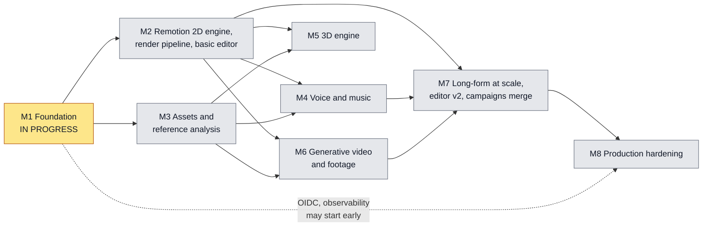
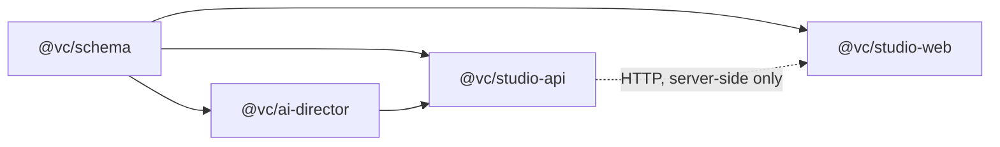

# Roadmap

| | |
|---|---|
| Last updated | 2026-10-09 |
| Current milestone | **M1 Foundation (in progress)** |
| Related | [PRD.md](PRD.md) (requirements by milestone) · [DECISIONS.md](DECISIONS.md) (ADRs) · [ARCHITECTURE.md](ARCHITECTURE.md) · [DEVELOPMENT.md](DEVELOPMENT.md) |

**Status legend.** *In progress*: being built now. *Planned*: scoped but not started. Nothing listed under a planned milestone
exists in the code. Scope for M2 to M8 is a plan and may change. Scope changes are recorded in this file. A change that reverses
an accepted decision also gets a new ADR in [DECISIONS.md](DECISIONS.md) that supersedes the old one.

No milestone has a date. Dates will be added once M1 gives a baseline for how long this kind of work takes.

## Overview

| Milestone | Theme | Status | Depends on |
|---|---|---|---|
| [M1](#m1-foundation) | Foundation: docs, pnpm monorepo, timeline v1, AI Director, prompt-to-storyboard API and web flow, tests | **In progress** | Existing repo |
| [M2](#m2-remotion-2d-engine-render-pipeline-and-basic-editor) | Remotion 2D engine, render pipeline, basic editor | Planned | M1 |
| [M3](#m3-assets-and-reference-analysis) | Assets and reference analysis | Planned | M1 |
| [M4](#m4-voice-and-music) | Voice and music | Planned | M2, M3 |
| [M5](#m5-3d-engine) | 3D engine | Planned | M2, M3 |
| [M6](#m6-generative-video-and-footage) | Generative video and footage | Planned | M2, M3 |
| [M7](#m7-long-form-at-scale-editor-v2-campaigns-merge) | Long-form at scale, editor v2, campaigns merge | Planned | M2, M4, M6 |
| [M8](#m8-production-hardening) | Production hardening | Planned | M7 (OIDC and observability can start after M1) |

## Dependency graph

Why each edge exists:

- **M1 → M2, M3.** Both build on the timeline v1 schema, the template catalog, the director and the studio API from M1.
  M2 and M3 do not depend on each other and can run in parallel.
- **M2 → M4, M5, M6, M7.** Each of these produces content that has to be rendered, so each needs the M2 render pipeline.
- **M3 → M4.** Voice and music files need asset storage. Voice-over alignment can reuse the M3 transcription adapter.
- **M3 → M5.** GLB uploads need storage and upload validation.
- **M3 → M6.** Footage, image and screen scenes need uploaded assets. Generated clips need somewhere to be stored.
- **M4 → M7.** Editor v2 edits audio tracks, and the campaigns flows depend on voice-over and ducked music.
- **M6 → M7.** Campaigns appends a shared base video after the personalized intro. In studio terms that is a footage scene.
- **M7 → M8.** Teams, billing and OIDC should land on one product with one auth system, which exists only after the campaigns
  merge. OIDC and observability do not need M7 and may start any time after M1.

## How a milestone closes

- Every exit criterion below is checked by running the package scripts (`pnpm --filter <pkg> typecheck`, `test`, `build`) plus
  the manual checks listed for that milestone. CI (`.github/workflows/ci.yml`) runs `pnpm install --frozen-lockfile`,
  `pnpm --filter @vc/studio-api db:generate`, `pnpm typecheck`, `pnpm test` and `pnpm build` with Postgres 16 and Redis 7
  services and `AI_PROVIDER=mock`.
- Measurements named in exit criteria (memory, latency, drift) are recorded in the milestone's closing notes, not only asserted.
- At close, this file, [PRD.md](PRD.md) and any affected docs are updated so they describe the code that shipped, and the next
  milestone's scope is reviewed.

---

## M1: Foundation

**Status: In progress.** Every deliverable below exists in the code and passed an adversarial review (2026-10-09); the review's
fixes are recorded in the [M1 spec amendments](milestones/M1_IMPLEMENTATION_SPEC.md#amendments-after-review-2026-10-09). What
keeps M1 open: the manual checks, the live check and CI on the final branch (exit criteria below), and the
[known gaps](#known-gaps-carried-out-of-m1).

### Goal

Prove the planning half of the product end to end. A written request becomes validated director artifacts and a versioned,
frame-exact timeline, which a user can inspect and preview as an animatic in the browser. All of it must work without any paid
service.

### Scope

Build the Universal AI Video Studio beside the existing campaigns MVP
([ADR-002](DECISIONS.md#adr-002-build-the-studio-beside-the-campaigns-mvp-merge-in-m7)). The campaigns directories
(`apps/api`, `apps/worker`, `apps/web`, `packages/core`, `packages/video`, `db/migrations`) are not changed, apart from the
package manifests touched by the pnpm migration.

- Repository: move from npm workspaces to a pnpm workspace
  ([ADR-001](DECISIONS.md#adr-001-pnpm-workspace-monorepo-migrated-from-npm-workspaces)). This landed at the start of M1,
  together with the CI switch to pnpm and the `video_studio` / `video_studio_test` databases in `docker-compose.yml`.
- `@vc/schema`: timeline v1 and every other shared contract.
- `@vc/ai-director`: the planning pipeline with a heuristic mock provider (default), a scripted mock (tests) and an Anthropic
  adapter.
- `@vc/studio-api`: the prompt-to-storyboard API and the director worker.
- `@vc/studio-web`: the web flow from request form to storyboard and animatic.
- Tests for all four packages, and the eight docs in `docs/`.

### Deliverables

| Path | Package | Contents |
|---|---|---|
| repo root | — | `pnpm-workspace.yaml`, `pnpm-lock.yaml`, root `studio:*` and `campaigns:*` scripts, `docker/postgres/init-databases.sql` (creates `video_studio` and `video_studio_test`), CI on pnpm with Postgres and Redis services and `AI_PROVIDER=mock`. |
| `packages/schema` | `@vc/schema` | Isomorphic Zod v4 schemas and types: common primitives (ids, hex colours, frames, safe URIs), render settings and `resolveDimensions`, frame math (`secondsToFrames`, largest-remainder `allocateFrames`, `formatTimecode`), assets, camera tracks and `expandCameraPreset`, transitions, 2D layers, scene content for 6 engines, scenes, chapters, brand kit, tracks, **Timeline v1** with invariants, resource limits, migrations, `ReferenceProfile` v1, LLM-safe director artifacts, the template catalog (14 templates: 11 `motion2d`, 3 `three`), API DTOs. |
| `packages/ai-director` | `@vc/ai-director` | `AIProvider` interface (with a config fingerprint); `HeuristicMockProvider` (default), `ScriptedMockProvider` (tests), `AnthropicProvider` (structured outputs, refusal fallbacks, typed error mapping, prompt-mode retry remembered per schema, per-model usage); `toStructuredOutputSchema`; pricing, usage tracking and run cost ceilings (`estimateRunCostCeilingUsd`); content-hash stage cache (`MemoryDirectorCache`) keyed by prompt, input and provider settings; `planStructure`; `AIDirector.planProject` and `regenerateScene` (no cache, stored-duration checks); repair loop and semantic validators; deterministic timeline compiler; versioned prompts (`PROMPT_VERSION = 'm1.1'`). |
| `apps/studio-api` | `@vc/studio-api` | Fastify 5 API on port 4100; Prisma 7 schema and three migrations (`User`, `ApiToken`, `Project`, `ProjectVersion`, `DirectorRun`, `DirectorCacheEntry`); hashed bearer-token auth; owner-scoped routes for health, readiness, me, system config, projects, director runs, versions and usage; resource limits; per-user quotas (active runs, runs per day, USD per day with cost-ceiling reservations and a live spend stop); per-IP failed-auth and per-user rate limits; BullMQ worker with heartbeats, a stale-run reaper and shutdown handling, and the inline queue; fail-fast enqueue; immutable version caching (summary columns, ETag); Prisma-backed per-user director cache; seed script. |
| `apps/studio-web` | `@vc/studio-web` | Next.js 16 App Router on `127.0.0.1:3000`: dashboard, project list, new-project form, project page (run progress, Cancel, Re-run with a confirmation in live mode, version switcher; tabs Storyboard, Preview (Remotion Player animatic), Brief, Script, Shot list, Timeline JSON, Usage, Request, with only the active tab rendered and lazy timeline and storyboard loading), settings page; server-only API client; run-polling and lazy-loading route handlers; security headers; loading, error and not-found states. |
| `docs/` | — | PRD, ARCHITECTURE, AI_DIRECTOR, TIMELINE_SCHEMA, DATABASE, ROADMAP, DECISIONS, DEVELOPMENT. |

Build order inside M1 (arrows point from a package to the packages that consume it):

### Explicitly not in M1

| Not in M1 | Where it lands |
|---|---|
| Rendering to MP4 or any other export | M2 |
| Template render components. The M1 preview is an animatic of branded cards, not the templates themselves. | M2 (2D), M5 (3D) |
| Editing scenes, text or colours; reordering scenes; comparing or restoring versions (M1 only switches between them) | M2 |
| An HTTP endpoint or UI for regenerating one scene. The library function `regenerateScene` exists and is tested. | M2 |
| Uploads, storage and reference analysis. The `ReferenceProfile` schema exists; nothing produces profiles. | M3 |
| Text-to-speech, music and audio mixing. Voice-over text and a caption track derived from it are in the timeline. | M4 |
| 3D rendering. 3D scenes can be planned and appear as animatic cards. | M5 |
| Video-generation providers, and the footage, image and screen engines. They are reported unavailable, and the director coerces such choices to `motion2d` with a warning. | M6 |
| Fetching asset URIs on the server, and the resolved-address (SSRF) check that goes with it | M3 |
| Login UI, teams, billing | M8 |

### Exit criteria and verification

Ticked when verified. The automated checks were run locally on 2026-10-09, after the review fixes: `pnpm typecheck` passed
for every package, and the test suites passed with 723 (`@vc/schema`), 184 (`@vc/ai-director`), 103 (`@vc/studio-api`),
94 (`@vc/studio-web`) and 8 (`@vc/core`) tests. `pnpm build` and CI were not re-run for this revision.

- [x] `pnpm --filter @vc/schema typecheck` and `test` pass. Tests cover the `resolveDimensions` examples, `allocateFrames`
      (exact sums, minimums, tie-breaking, `RangeError`), every timeline invariant with a precise error path, `SafeUriSchema`
      rejections, limits, and migrations with an injected fake v0→v1 migration.
- [x] `pnpm --filter @vc/ai-director typecheck` and `test` pass with no network access. Tests cover: valid and invalid
      fixtures for every LLM-facing schema; `toStructuredOutputSchema` stripping unsupported keywords and closing objects;
      the full pipeline with `HeuristicMockProvider` for genres × {5 s, 30 s, 10 min, 25 min, 2 h} (valid timeline, exact
      frame sums, chunked chapters, scene counts in range); repair success and exhaustion (`VALIDATION_FAILED`); a second
      identical run making 0 provider calls; cost maths; the engine-coercion warning; `regenerateScene` leaving other scenes
      and timing identical; cancellation; `LIMIT_EXCEEDED` before any provider call; the `AnthropicProvider` request shape
      (model, `output_config.effort` and `format`, system `cache_control`, `betas` plus `fallbacks`, no `thinking` or
      `temperature`) and response handling (text extraction, usage mapping, refusal, `max_tokens`, BadRequest → prompt-mode
      retry) against an injected fake client.
- [x] `pnpm --filter @vc/studio-api typecheck` and `test` pass against `video_studio_test` (migrated with
      `prisma migrate deploy`). Tests cover: health; 401 without a token and with a bad token; project create, list, get and
      delete; 400 validation; 422 limits; owner isolation (404); a director run end to end producing version 1, whose timeline
      re-parses with `TimelineSchema`, and usage; a second run producing version 2 with cache hits and 0 new tokens; 409 on a
      concurrent run; cancel; 429 quota; a provider failure recorded as run `FAILED` with a code; system config containing no
      secrets. Since the review also: readiness, quota reservations and the live spend stop, rate limits, the reaper,
      shutdown, fail-fast enqueue, version caching and `DATA_INTEGRITY`.
- [x] The Prisma migration SQL is committed under `apps/studio-api/prisma/migrations` (three migrations).
- [x] `pnpm --filter @vc/studio-web typecheck`, `test` (pure helpers: duration formatting and parsing, form → `VideoRequest`
      mapping) and `build` pass (locally and in CI).
- [x] The campaigns MVP still typechecks and `pnpm --filter @vc/core test` passes under the pnpm workspace.
- [x] CI passes on the M1 branch (GitHub Actions: install, typecheck, tests with Postgres 16 + Redis 7 services, build).
- [x] Manual check with `AI_PROVIDER=mock` and `QUEUE_DRIVER=bullmq`: start the API, the worker and the web app; create a
      project; watch progress; open every tab; play the animatic; cancel a run; re-run and see cached calls in the Usage tab.
      (Done with Playwright against a production build: form → run → every tab, animatic seek, re-run with all stages cached,
      cancel covered by the API suite and the BullMQ smoke test; no console errors under the CSP.)
- [ ] Optional manual check with `AI_PROVIDER=anthropic` and a real key: one short run, with usage and estimated cost shown,
      and the observed latency per call written down. Not part of CI.
- [x] Docs describe the shipped code and label everything else as planned (reconciled after the review; links checked).

### Dependencies

- The existing repository, Node ≥ 22, pnpm 10.28 (`corepack enable`).
- Postgres 16 and Redis 7 from `docker-compose.yml` (or local installs).
- No paid service. An Anthropic API key is optional and only needed for the manual live check.

### Risks

| Risk | Mitigation in M1 |
|---|---|
| Live Claude behaviour (validity rate, refusals, latency, cost) is not covered by CI. | Repair loop, prompt-mode fallback, server-side refusal fallbacks, the manual live check. An automated live evaluation is PRD Q15. |
| Long live runs take hours. A 2 h `long-form` plan makes 127 sequential LLM calls; at 30 s per call (not measured) that is over an hour. | The run timeout scales with the plan (`max(DIRECTOR_RUN_TIMEOUT_MS, steps × DIRECTOR_STEP_TIMEOUT_MS)`, 4 h 16 min for that plan). Record real per-call latency in the live check. Parallel chapters may be revisited after measurement ([ADR-010](DECISIONS.md#adr-010-chapter-chunked-generation-for-long-videos)). |
| Live spend on long videos. | Each run reserves its cost ceiling against the daily USD cap and is stopped when the cap is reached ([ADR-018](DECISIONS.md#adr-018-spend-caps-enforced-with-a-per-run-cost-ceiling-reservation-and-a-live-budget-check)). With the default $25 a 2 h `long-form` video on `claude-opus-5-5` cannot start; operators raise the cap deliberately. |
| The scene-specs output schema could be rejected by the structured-output endpoint as too complex. | The schema contains only the templates selected for the chapter, and the adapter retries once in prompt mode on a schema-related 400 and remembers the rejection per schema ([ADR-006](DECISIONS.md#adr-006-claude-structured-outputs-instead-of-forced-tool-use)). |
| Four packages are built at the same time against one contract, so they can drift apart. | All DTOs live in `@vc/schema`. studio-web validates every API response with those schemas, and the API tests re-parse stored timelines. |
| The animatic could be mistaken for final output, and mock output for real AI output. | The UI labels the preview as an animatic and shows mock mode explicitly. |

---

## M2: Remotion 2D engine, render pipeline and basic editor

**Status: Planned.**

### Goal

Turn a timeline into a validated video file, and let users fix a plan without regenerating all of it.

### Scope

Remotion 2D engine and render pipeline: template components, frame-range segment rendering, FFmpeg assembly, a render queue
with progress and cancel, export validation. Basic editor: scene list and reorder, text and colour edits, a regenerate-scene
endpoint and UI, a project versions UI.

### Planned deliverables

- Remotion components for all 11 `motion2d` templates, driven by timeline props, 2D layers, 2D camera tracks, transitions and
  the caption track.
- A render worker process using `@remotion/renderer`. It renders frame ranges of the timeline composition as separate segments
  with identical encoder settings, joins them with FFmpeg concat and muxes one continuous audio track. (The campaigns worker
  already joins identically encoded segments with `-c copy`. The approach is ported, not imported, because the products share
  no code before M7.)
- Render jobs and segments persisted in Postgres (the data model is designed in M2), queued through the queue abstraction
  ([ADR-014](DECISIONS.md#adr-014-queue-abstraction-bullmq-with-an-inline-driver-for-tests)) on a queue separate from director
  runs.
- Render progress, cancellation, per-segment retry, render timeouts, and temp-file cleanup on success, failure and cancel.
- Export validation with ffprobe before an export is offered: duration within 1 frame of `durationInFrames / fps`, fps,
  dimensions, codecs, expected streams.
- A storage interface for render outputs, with a local-disk driver. The S3-compatible driver arrives in M3.
- Editor: scene list, reorder (the compiler re-allocates frames), text and colour edits validated against each template's
  props schema, regenerate one scene (a `POST` endpoint wrapping `AIDirector.regenerateScene`, plus UI), and a versions list
  and viewer. Every edit saves a new immutable `ProjectVersion`.
- Decisions on PRD open questions Q1 (is `three` reported available before M5), Q3 (burned-in captions and/or SRT/VTT),
  Q4 (first codecs), Q6 (bypassing the stage cache for a fresh take), Q12 (containerizing the studio apps) and Q15 (live
  evaluation).
- Candidates carried from M1 ([Known gaps](#known-gaps-carried-out-of-m1)): response compression in studio-api, a paginated
  version list, and the M1 live check if it has not been done.

### Exit criteria and verification

- A 30 s 16:9 1080p `motion2d` timeline renders to an MP4 that passes ffprobe validation. Each aspect-ratio preset (9:16,
  16:9, 1:1, 4:5) renders at least once in tests.
- A 10 min timeline renders in segments. Peak worker memory is measured and recorded, and it does not grow with video length
  (compared against the 30 s run).
- Killing one segment's render retries only that segment. Cancelling mid-render stops all work and removes temp files.
- Each `motion2d` template has a still-frame render test at fixed frames.
- A deliberately corrupted output fails export validation and is never offered for download.
- Reordering and editing produce new versions that re-parse with `TimelineSchema`. Regenerating a scene leaves every other
  scene byte-identical in the new version.

### Dependencies

- M1: timeline v1, template catalog, `regenerateScene`, queue abstraction, `ProjectVersion`.
- FFmpeg and ffprobe on render hosts, plus Chromium (Remotion downloads `chrome-headless-shell` unless a path is configured, as
  the campaigns worker already allows).

### Risks

| Risk | Mitigation |
|---|---|
| Audio at segment joins. Encoding audio per segment adds AAC priming and padding, which causes gaps or clicks at joins. | Render video segments without audio and mux one audio track for the whole timeline. |
| Fonts. Headless Chromium only has the fonts it is given; timelines default to `Inter`. | Bundle a fixed font set with the render worker. Reject or substitute unknown `FontFamily` values with a warning. |
| Render cost and time for long videos on a single worker. | Segment rendering in M2; distribution across workers in M7. |
| Remotion licensing. Remotion is free for individuals and companies with up to 3 employees; larger companies need a company license. | Confirm licensing before any deployment by a larger organization. |
| Template visual quality falls short of "professional motion graphics". | Still-frame tests catch regressions, not taste. Review renders of every template before M2 closes. |

---

## M3: Assets and reference analysis

**Status: Planned.**

### Goal

Let users bring their own material, and turn reference videos into structured style data that the director can use.

### Scope

S3/MinIO storage; uploads with size checks and MIME sniffing; ffprobe metadata; keyframe and scene sampling; palette;
transcription adapter; camera-movement classification; `ReferenceProfile` generation; Claude vision on sampled frames.

### Planned deliverables

- An S3-compatible storage driver (S3, MinIO, R2) behind the storage interface from M2, with MinIO added to local development.
- Upload endpoints with configurable size limits, MIME sniffing from file content (not the extension or the client's header),
  persisted asset records, and `asset://` references in timelines.
- A guarded fetcher for `https:` asset URIs (ingest, analysis, and later the renderers): it resolves the host and refuses
  private, loopback, link-local, carrier-grade NAT and cloud-metadata addresses at fetch time, re-checks every redirect and
  pins the checked address for the connection. `SafeUriSchema` only checks the URI's shape (no IP literals, no local names) and
  does not resolve DNS ([TIMELINE_SCHEMA.md section 10.2](TIMELINE_SCHEMA.md#102-safeuri-rules)).
- Analysis jobs on the queue, cancellable: ffprobe metadata, scene detection, keyframe sampling (downscaled stills), audio
  extraction, a transcription adapter (mock by default), palette extraction, typography, transition and camera-movement
  classification, and pacing (average shot length, cuts per minute).
- `ReferenceProfile` v1 produced, validated with the M1 schema, stored, and passed to the director.
- Claude vision on sampled frames, metadata and transcript only. Raw video is never sent to the model.
- New-project form: reference uploads (up to 20 per request, the existing `referenceAssetIds` field) and a brand logo.
- Decisions on PRD Q2 (should the image engine move earlier), Q8 (transcription provider) and Q9 (object storage, signed URLs).

### Exit criteria and verification

- An upload whose content does not match its declared type or extension is rejected. Oversize uploads are rejected before they
  are fully read.
- A test fetch of an `https:` URI whose host resolves to a private, loopback or metadata address is refused, including through
  a redirect.
- A sample reference video yields a `ReferenceProfile` that passes the schema, and a `reference-based` run uses its
  `pacing.averageShotSeconds`.
- Tests assert that provider requests contain only image blocks and text, with no video payload.
- Temp files from analysis are removed on success, failure and cancellation.

### Dependencies

- M1: `ReferenceProfile` v1 schema, `AssetRef` and `SafeUriSchema`, director support for references.
- ffmpeg and ffprobe on analysis hosts. A transcription provider is optional (the mock is the default).
- Independent of M2, except that the storage interface should be shared. Whichever milestone starts first defines it.

### Risks

| Risk | Mitigation |
|---|---|
| Malicious or malformed media (polyglot files, decompression bombs, crafted inputs for FFmpeg) reaching the analysis worker. | Content sniffing, size and duration limits, per-job timeouts, a separate worker process. Full sandboxing is M8. |
| Vision cost grows with the number of sampled frames. | Sample a capped number of downscaled keyframes per reference; record vision tokens per stage like every other call. |
| Camera-movement and typography classification may be inaccurate. | Treat these fields as hints. They are optional in the schema, and the profile carries `warnings`. |
| Rights and retention of uploaded reference material and the frames sampled from it. | Define retention and deletion before M3 closes; deleting a project or asset must delete derived frames. |

---

## M4: Voice and music

**Status: Planned.**

### Goal

Videos that speak: narration, music and captions that line up with what is on screen.

### Scope

TTS and music provider adapters, voice-over alignment, word-timed captions, ducking, loudness normalization.

### Planned deliverables

- TTS and music adapters behind provider interfaces. Mock by default; a real provider is shown as connected only when its
  credentials are configured. The campaigns MVP already uses ElevenLabs, which is a candidate (PRD Q8).
- Voice-over generation from the narration text already in timeline v1, producing assets on the `voiceover` audio track.
- Alignment that produces word timestamps. Caption cues are re-timed from them, replacing M1's proportional cues.
- Music ducking under voice and loudness normalization in the render pipeline. The campaigns worker already does sidechain
  ducking and normalizes voice to -16 LUFS; that approach can be ported.
- A decided policy for reconciling voice-over length with scene durations (PRD Q7) and an export loudness target (PRD Q11).

### Exit criteria and verification

- A rendered export with voice-over and music meets the chosen loudness target, measured in a test.
- Word-timed captions line up with the voice-over within a tolerance fixed and tested in M4.
- With no TTS provider configured, voice-over is reported unavailable and the video still renders, with captions.

### Dependencies

- M2 (render pipeline and audio muxing) and M3 (storage for audio assets; the transcription adapter for alignment).
- At least one TTS provider account for the manual live check. CI uses the mock.

### Risks

| Risk | Mitigation |
|---|---|
| Synthesized narration is longer or shorter than the planned scenes. | Decide Q7 first. Any re-timing must go through the compiler so frame invariants still hold. |
| Voice consent and licensing, especially for cloned voices. | Only provider voices with clear terms in M4; voice cloning is not in scope. |
| Alignment quality varies by language. | Test at least the languages the studio claims to support; fall back to proportional cues with a warning. |
| TTS cost for long videos. | Per-run estimates and quotas like the director's; cached synthesis for unchanged narration. |

---

## M5: 3D engine

**Status: Planned.**

### Goal

Render the 3D scenes that the director can already plan.

### Scope

React Three Fiber, `@remotion/three` and Drei; GLB uploads; camera presets.

### Planned deliverables

- Components for `product-turntable`, `logo-reveal-3d` and `floating-shapes`, rendered from the frame number only (no
  wall-clock time, no unseeded randomness).
- 3D camera tracks from `expandCameraPreset` (orbit, dolly, crane, push-in) applied in render.
- GLB uploads, validated and size-limited, bound through `three.modelAssetId`.
- The environment and lighting presets defined by the timeline schema.
- Engine availability for `three` reflects whether the render worker can actually render WebGL.

### Exit criteria and verification

- Each 3D template renders headless in the render worker, and still-frame tests at fixed frames pass within a fixed pixel
  tolerance.
- An uploaded GLB replaces the primitive in `product-turntable`.
- A worker without WebGL support reports `three` as unavailable with a reason, instead of failing renders.

### Dependencies

- M2 (render pipeline) and M3 (uploads and storage for GLB files).

### Risks

| Risk | Mitigation |
|---|---|
| Headless WebGL. Without a GPU, rendering falls back to software GL and can be very slow. | Measure software-GL render time per frame. Decide whether 3D scenes need GPU workers before M5 closes. |
| Heavy or hostile GLB files (huge textures, extreme polygon counts). | Limits on file size, texture size and polygon count, checked at upload. |
| Pixel output differs between GPU and software rendering. | Still-frame tests use a tolerance and run on one pinned worker image. |

---

## M6: Generative video and footage

**Status: Planned.**

### Goal

Add footage, images, screen recordings and AI-generated clips as scene engines, with cost kept under control.

### Scope

Provider adapters (for example Runway, Kling, Pika; none is connected until configured), async jobs, cost controls; the
footage, screen and image engines.

### Planned deliverables

- A video-generation provider interface. An adapter reports itself available only when its credentials are configured and a
  health check passes. A mock provider is used in tests.
- Async generation jobs: a `generated` scene moves `pending` → `queued` → `ready` (with an asset) or `failed`, through
  polling or verified webhooks, with timeouts and cancellation.
- Cost controls: an estimate per job, per-user daily caps, and explicit confirmation before expensive jobs.
- Footage, image and screen engines: trim, playback rate, fit, Ken Burns, zoom, pan and parallax, zoom regions, cursor
  highlight, as defined in timeline v1.
- Engine availability computed from configuration and available assets, replacing the static values reported in M1.

### Exit criteria and verification

- With no provider configured, `generated` is reported unavailable and the director coerces such choices to `motion2d`
  (M1 behaviour, re-verified).
- With the mock video provider, a timeline containing generated scenes completes end to end, and a failed job leaves a scene
  that can be retried on its own.
- A job whose estimate exceeds the configured cap is refused before any provider call.
- A footage scene renders from an uploaded clip, and an image scene renders with each animation preset.

### Dependencies

- M2 (render pipeline) and M3 (uploads and storage). A provider account per adapter for manual live checks.

### Risks

| Risk | Mitigation |
|---|---|
| High and variable cost per generated second. | Estimates, caps and confirmation before any job; usage recorded per job. |
| Provider APIs, pricing and content policies change often. | One adapter per provider behind a narrow interface; provider errors map to typed, retryable or non-retryable errors. |
| Visual consistency between generated clips and template scenes (characters, brand colours). | Pass brand and style data from the brief into generation prompts; keep templates for text and brand-critical scenes. |
| Webhooks are an inbound attack surface. | Verify signatures; accept only known job ids. |

---

## M7: Long-form at scale, editor v2, campaigns merge

**Status: Planned.**

### Goal

Make videos of 20 minutes and longer routine to render and edit, and fold the campaigns MVP into the studio.

### Scope

Distributed chapter/segment rendering, resumable renders, validation beyond 20 minutes, editor v2 (tracks, transitions,
audio), and the campaigns MVP merged as a module.

### Planned deliverables

- Chapter and segment render jobs fanned out across workers. Completed segments are persisted, so a render resumes after a
  crash without redoing them.
- End-to-end validation of long exports (25 min and 2 h test cases): duration, A/V sync at the end of the file, chapter
  boundaries.
- Editor v2: multi-track editing (overlay, audio, video), transition editing, audio levels and fades. If this needs gaps or
  overlaps on the scene track, it becomes timeline schema v2 with a migration
  ([ADR-011](DECISIONS.md#adr-011-integer-frames-and-a-versioned-timeline-with-migrations)).
- Campaigns as a studio module: a campaign binds CSV variables into a studio project or template, renders per contact through
  the studio pipeline, and sends via WhatsApp. One auth system; campaign data migrated; the old campaigns apps are retired
  only after regression tests pass on the module. PRD Q13 (Prisma or raw SQL for campaigns tables; porting Express routes) is
  decided at the start of M7.

### Exit criteria and verification

- A 25-minute render completes after a worker is killed midway, without re-rendering segments that had already finished.
- A 2-hour export passes validation. *Target:* A/V drift of at most 1 frame at the end of the file.
- The campaigns flows (CSV import, per-contact render, dry-run send, delivery-status webhooks, one message per contact)
  pass regression tests on the merged module.

### Dependencies

- M2 (render pipeline), M4 (audio, needed by editor v2 and campaigns), M6 (footage scenes, needed for the campaigns base
  video), and M3 through those.

### Risks

| Risk | Mitigation |
|---|---|
| Coordinating many render workers (partial failures, duplicate segment work, storage throughput). | Segment state in Postgres as the source of truth, idempotent segment jobs, measured throughput. |
| A/V drift over 2 h from rounding in audio or video timing. | Integer frames throughout ([ADR-011](DECISIONS.md#adr-011-integer-frames-and-a-versioned-timeline-with-migrations)); one continuous audio track; a drift test. |
| The campaigns merge regresses a working product (double sends, broken webhooks). | Regression tests before retiring anything; keep the old apps runnable until the module passes them. |
| Editor v2 forces a timeline v2. | Plan the migration early; v1 timelines must keep opening. |

---

## M8: Production hardening

**Status: Planned.**

### Goal

Make the studio safe to run for several organizations on the public internet.

### Scope

OIDC auth, teams, billing and quotas, observability, sandboxed workers, backups, CDN.

### Planned deliverables

- OIDC login with sessions in studio-web, replacing the single server-side token. API tokens remain for programmatic access
  ([ADR-015](DECISIONS.md#adr-015-m1-auth-is-hashed-per-user-bearer-tokens-oidc-in-m8)).
- Organizations and teams with roles; project sharing.
- Billing, plans and per-plan quotas, replacing the deployment-wide env limits as the main control (PRD Q14).
- Director-cache eviction and organization scope (PRD Q5; the cache is already per user).
- Metrics, tracing, dashboards and alerting (queue depth, run and render failure rates, cost).
- Render and analysis workers in sandboxes: isolated containers, no outbound network by default, restricted filesystem.
- Postgres backups with tested restores; object-storage versioning; CDN for delivery.

### Exit criteria and verification

- Security review completed and its findings resolved or accepted in writing.
- A restore drill from backup succeeds.
- A load test at a target agreed at the start of M8 passes.
- Quotas are enforced per plan, and users in one organization cannot read another organization's projects, runs, assets or
  cache entries.
- studio-web can be exposed publicly without an authenticating proxy in front of it.

### Dependencies

- M7 (one product and one auth system). OIDC and observability can start any time after M1.
- An OIDC identity provider and a billing provider (not chosen).

### Risks

| Risk | Mitigation |
|---|---|
| Moving from per-user tokens to organizations touches every owner-scoped query. | All queries are already owner-scoped in M1; switch the scope key in one place per service and test isolation per organization. |
| Sandboxing Chromium and FFmpeg can break rendering or slow it down. | Measure render time inside and outside the sandbox before switching. |
| Billing errors directly affect users' money. | Reconcile usage records against provider invoices before charging. |

---

## Known gaps carried out of M1

Found while writing and reviewing M1. They are not part of any milestone's scope above unless a milestone says so. Each needs
an owner.

| Gap | Impact | Suggested handling |
|---|---|---|
| Live latency and cost have not been measured. Chapters run sequentially, so a live multi-hour plan takes hours (a 2 h `long-form` plan is 127 sequential calls). | Timeout scaling and cost ceilings are estimates; a live 2 h run may hit the scaled timeout (4 h 16 min by default) or need a higher `DIRECTOR_STEP_TIMEOUT_MS`. | The M1 live check; record per-call latency and cost, then tune the defaults in DEVELOPMENT.md. |
| The default daily spend cap blocks long videos on large models. With `LIMIT_DIRECTOR_USD_PER_DAY=25` on `claude-opus-5-5`, the most chapters one run can have is 13 (about 1 h of `long-form`); a 2 h `long-form` run reserves $46.48 and is refused. | Deliberate (the ceiling assumes every call produces its full `max_tokens`), but surprising for a product that advertises 2 h videos. | Documented in DEVELOPMENT.md section 4.4. Revisit the ceiling's input budgets and the default cap after the live check. |
| The reserved cost ceiling assumes one attempt per call; repairs are not reserved. | Spend can exceed the cap by what the stages in flight cost after it is reached (the live check stops the run before the next stage). | Accept for M1; a per-call usage ledger with billing (M8). |
| `DirectorCacheEntry` has no eviction or TTL. Rows written before the M1 review (`PROMPT_VERSION` `m1.0`, older key composition) are orphans that no run can hit. | Unbounded table growth. (The cache is scoped per user, so a hit no longer reveals another user's request.) | Age-based cleanup (DATABASE.md section 9); PRD Q5, M8 at the latest. |
| The cache key covers the prompt text, the stage input and the provider settings, but not the schema body. | Changing an LLM-facing schema or template props schema without changing the prompt text could reuse an output that still validates under the new schema. | Rule: bump `PROMPT_VERSION` on any change to a prompt, an LLM-facing schema or a template props schema. |
| `@fastify/compress` is not installed: studio-api sends JSON uncompressed. | A multi-hour version (several MB of timeline JSON) crosses the API-to-web hop uncompressed. The web app gzips its own `/api/...` responses to the browser, and versions are cached on both sides (ETag and an in-process LRU in the API, a small TTL cache in the web server). | Add response compression in M2 when versions grow. |
| The version list is capped at the latest 100 versions and not paginated (`GET /v1/projects/:id/versions` returns a plain array). | Older versions of a project with more than 100 runs cannot be listed, though each one is still reachable by number. | A paginated list with the M2 versions UI. |
| The heuristic mock writes English whatever the request `language`. | Mock runs of non-English requests look wrong; only Claude follows the language tag. | Accept (the mock exercises code paths, not content); document in the UI if it confuses users. |
| A run reaped as `WORKER_LOST` keeps only the usage written with its last progress update and has no per-stage report. | The spend of the stage in flight when the worker died is missing from usage and quotas. | Accept for M1; a per-call usage ledger (M8). |
| `DirectorRun.warnings` is stored but not exposed by the API, so the UI does not show engine coercions or truncated captions. | Users cannot see why a scene uses another engine. | Add warnings to `DirectorRunDTO` with the M2 editor. |
| studio-web acts as one configured API user. | Anyone who can reach studio-web acts as that user. It binds `127.0.0.1` by default and must not be exposed publicly without an authenticating proxy. | Documented in PRD 7.3. Fixed by OIDC in M8. |
| M1 has no endpoint to issue or revoke API tokens; the seed script creates the dev token and never re-activates a revoked one. | Extra users or token rotation need manual database work. | An admin CLI if needed before M8; OIDC in M8. |
| No automated live-provider evaluation. | Prompt or model regressions are invisible to CI, which only runs the mock. | PRD Q15, decided in M2. |
| `three` is reported available for planning although nothing renders it until M5. footage, image and screen report "requires uploaded assets (Milestone 3)", but they render only from M6. | The settings page can suggest more than the product does. | PRD Q1 and Q2. Decide in M2 and M3, and adjust the reasons then. |
| `SafeUriSchema` checks URI shape only; it does not resolve DNS. | Harmless in M1, which fetches nothing. A fetcher that trusted it could be pointed at a private address through a public name. | The guarded fetcher in M3 scope. |
| The Remotion Player is used without `acknowledgeRemotionLicense`. | The Player may log Remotion's license notice in the browser console. Companies with more than 3 employees need a Remotion company license. | Owner decision on licensing; set the prop only after it. |

Resolved during M1:

- CI and the root README were moved from npm to pnpm together with the workspace migration.
- The Prisma client is generated by the `@vc/studio-api` `postinstall` script, and `prisma.config.ts` loads
  `apps/studio-api/.env`; the README quick start covers install, the dev token, migrate and seed.
- A worker crash no longer leaves a run `RUNNING`: runs heart-beat, and a stale-run reaper fails them with `WORKER_LOST`
  (and lost queued runs with `QUEUE_LOST`); shutdowns record `SHUTDOWN`
  ([ADR-019](DECISIONS.md#adr-019-run-heartbeat-and-stale-run-reaper-failed-runs-are-never-re-queued)).
- Long runs no longer hit a fixed 30-minute timeout: it scales with the plan's step count.
- The stage cache is scoped per user and keyed by the stage input and provider settings
  ([ADR-020](DECISIONS.md#adr-020-stage-cache-scoped-per-user-and-keyed-by-stage-input-and-provider-configuration)).
- The daily USD quota is no longer soft: active runs reserve their cost ceilings under a per-user lock, and running runs stop
  at the cap ([ADR-018](DECISIONS.md#adr-018-spend-caps-enforced-with-a-per-run-cost-ceiling-reservation-and-a-live-budget-check)).
- A versions switcher exists on the project page, and the Request tab shows the stored request.
- Redis outages no longer hang a run start: the enqueue fails fast with 503 `QUEUE_UNAVAILABLE`, and `GET /ready` reports
  the outage.
